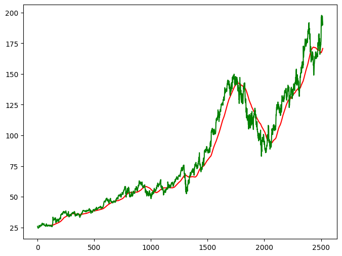
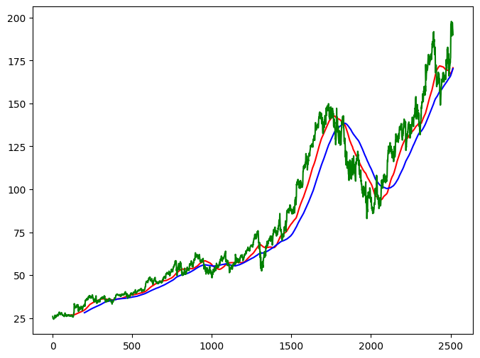

# Stock Price Prediction App with LSTM

This is a Machine Learning web app built using Keras, Streamlit, and Yahoo Finance API to predict stock prices using historical closing data.

## Features

- Real-time stock ticker input (e.g., GOOG, AAPL)
- Visualize stock trends using moving averages (MA100, MA200)
- Predict future prices using a deep LSTM model
- Compare predicted vs actual prices with plots
- Interactive web UI built using Streamlit

## Project Overview

This project trains an LSTM neural network on stock price data from Yahoo Finance between 2015–2025. The model uses the previous 100 days of closing prices to predict future prices.

## Sample Output

  
  


## How to Run the Project

1. Clone the Repository

```bash
git clone https://github.com/Constellation-destroyer/ml-stock-predictor.git
cd ml-stock-predictor

2. Install Dependencies
pip install -r requirements.txt

3. Train the Model
python train_model.py

4. Run the App
streamlit run app.py

Tech Stack
Python
Streamlit
TensorFlow / Keras
Pandas / NumPy
yFinance
Matplotlib
Scikit-learn

What I Learned
Time-series forecasting using LSTM
Preprocessing stock data for machine learning
Creating sliding windows for sequential input
Building Streamlit apps for ML model deployment
Saving and loading .keras model formats